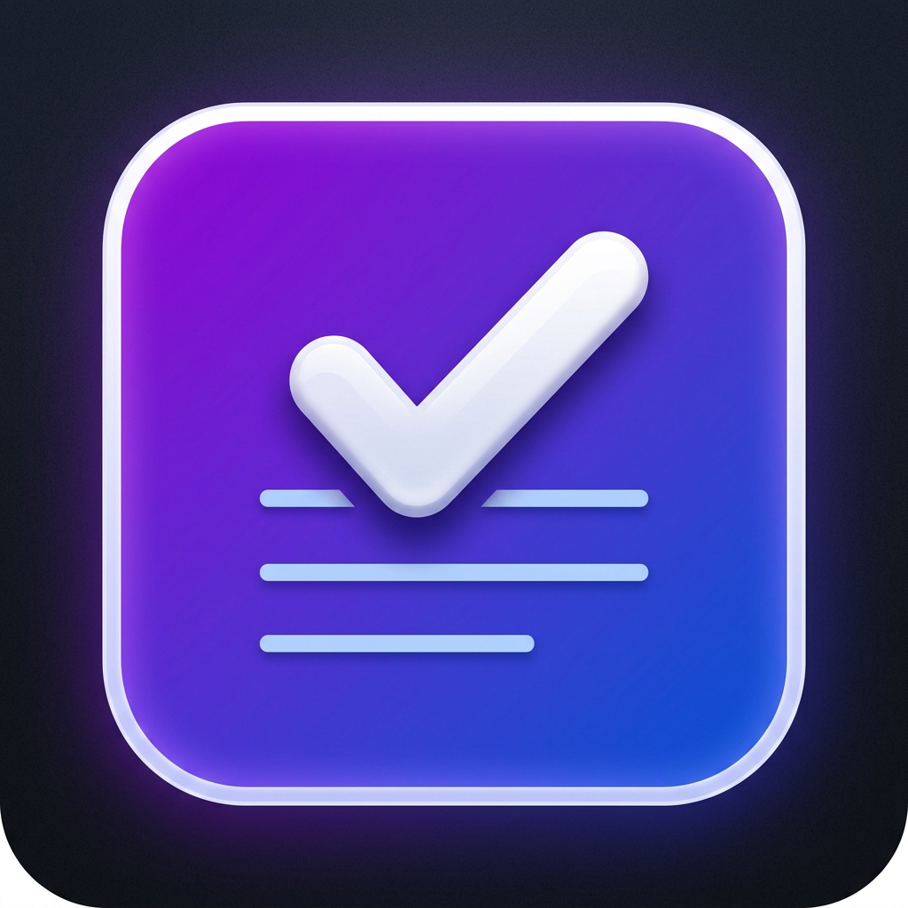
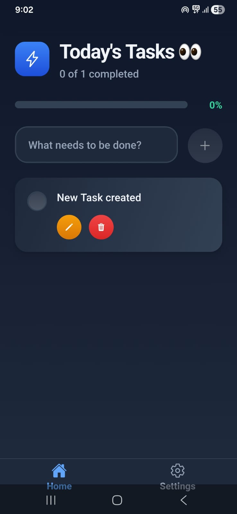
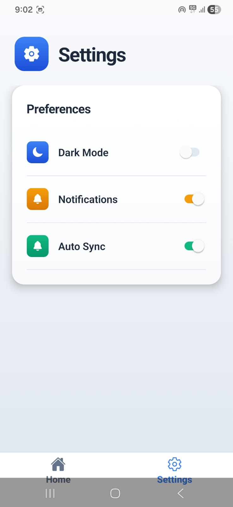
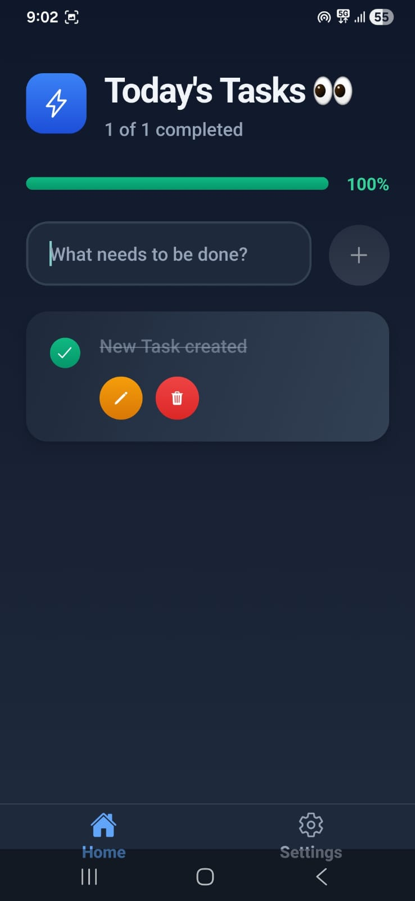

# 📝 Premium Todo List App

A sleek, modern, and beautiful Todo List mobile application built with **React Native**, **Expo Router**, and **Convex backend**. Designed with high aesthetics, smooth transitions, and a premium dark/light mode UI.

---

## 📸 Screenshots & Mockups

| App Icon | Active Tasks | Settings | Completed Tasks |
| :---: | :---: | :---: | :---: |
|  |  |  |  |

---

## ✨ Features

- **🎨 Premium UI/UX:** Stunning color palettes, soft shadows, and clean layouts.
- **⚡ Real-time Sync:** Powered by Convex backend for instantaneous data synchronization.
- **📂 File-based Routing:** Utilizing Expo Router for robust and native navigation.
- **📱 Responsive & Native Feel:** Built with modern React Native component guidelines.

---

## 🚀 Download APK (Android)

You can download the compiled APK file directly to your Android device from the official GitHub Release:

👉 **[Download TODO.apk (v1.0.0)](https://github.com/Adit122022/Learning_Languages/releases/download/todo-v1.0.0/TODO.apk)**

*Note: For testing, you may need to allow "Install from Unknown Sources" on your Android device.*

---

## 🛠️ Developer Setup & Local Run

### 1. Prerequisites
Make sure you have Node.js installed on your PC.

### 2. Install Dependencies
Clone the repository, navigate to this folder, and run:
```bash
npm install
```

### 3. Setup Convex Backend URL
Create a `.env` file in the root of this folder and add your Convex URL:
```env
EXPO_PUBLIC_CONVEX_URL=https://animated-octopus-21.convex.cloud
```

### 4. Start the App
Start the Metro bundler:
```bash
npx expo start
```
- Press **`a`** to open in Android Emulator.
- Press **`i`** to open in iOS Simulator.
- Scan the QR code using the **Expo Go** app on your physical device.

---

## 📦 Building your own APK

To build a fresh APK, configure your Expo account and run:
```bash
npx eas build --platform android --profile preview
```
