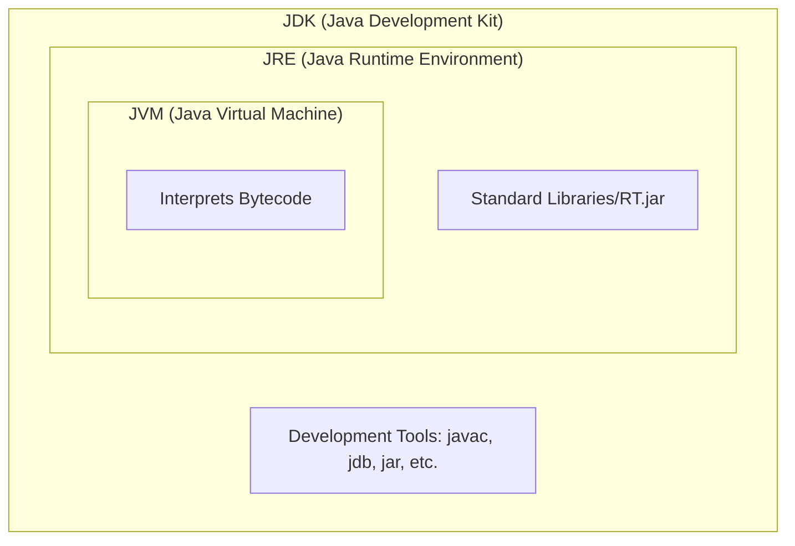

# ☕ Java Mastery: Unit-I Academic Study Guide

This document is a detailed academic reference for **Unit-I: Core Java**, structured according to university standards and referenced from professional sources like **Javatpoint** and **W3Schools**.

---

## 📜 1. History of Java

Java's history is anchored in the **"Green Project"** at Sun Microsystems.

- **Origin (1991):** Conceived by **James Gosling**, Patrick Naughton, and Mike Sheridan.
- **Goal:** To create a platform-independent language for digital consumer electronic devices.
- **Evolution of Name:**
  1. **"Greentalk"**: Original name, file extension was `.gt`.
  2. **"Oak"**: Renamed after an oak tree outside Gosling's office.
  3. **"Java" (1995)**: Renamed because "Oak" was already trademarked. Inspired by Java coffee from Indonesia.
- **Initial Release:** Released by Sun Microsystems in 1995. Now owned by **Oracle Corporation**.
- **Philosophy:** **WORA** (Write Once, Run Anywhere).

---

## 🏗️ 2. Java Infrastructure (JDK, JRE, JVM)

Understanding the difference between these three is fundamental to Java architecture.

### 🏛️ Hierarchy Relationship

| Component | Definition       | Physical Existence?   | Role                                    |
| :-------- | :--------------- | :-------------------- | :-------------------------------------- |
| **JVM**   | Abstract Machine | No (Runtime instance) | Runs the bytecode.                      |
| **JRE**   | Software Package | Yes                   | Provides environment to run Java files. |
| **JDK**   | Development Kit  | Yes                   | Tool to develop and run Java programs.  |

### 🛠️ JVM Architecture Deep Dive

1. **Class Loader**: Loads `.class` files, links them, and initializes them.
2. **Runtime Data Areas**:
   - **Method Area**: Stores class-level data (static variables).
   - **Heap**: Stores objects and arrays.
   - **Stack**: Stores local variables and partial results (Thread-safe).
   - **PC Register**: Stores the address of the current instruction.
   - **Native Method Stack**: Stores native method information.
3. **Execution Engine**:
   - **Interpreter**: Fast start, executes line-by-line.
   - **JIT Compiler**: Compiles frequently used code to native machine code for speed.
   - **Garbage Collector**: Manages memory automatically.

---

## � 3. Core Basics (Data Types & Variables)

Java is strictly typed.

- **Primitive Data Types**: `byte`, `short`, `int`, `long`, `float`, `double`, `boolean`, `char`.
- **Variables**: Local, Instance (Field), and Static (Class) variables.

---

## 🛠️ 4. Operators & Control Flow

### Operators

Detailed categories include Arithmetic, Unary, Relational, Logical, Ternary, and Bitwise.

### Control Statements

- **Selection**: `if-else`, `switch-case`.
- **Iteration**: `for`, `while`, `do-while`.
- **Jump**: `break`, `continue`.

---

## 🏛️ 5. OOPs (Classes & Inheritance)

- **Methods**: Functionality defined within a class.
- **Classes**: Template for objects.
- **Inheritance**: Acquiring properties of a parent class.
  - Java supports Single, Multilevel, and Hierarchical inheritance through classes.
  - **Multiple Inheritance** is achieved only through **Interfaces**.

---

## ⚠️ 6. Exception Handling & Advanced Topics

### Exception Handling

Handling runtime errors via `try`, `catch`, `finally`, `throw`, and `throws`.

### Multithreading

Simultaneous execution of multiple parts of a program to maximize CPU utilization.

- Methods: `start()`, `run()`, `sleep()`, `join()`.

### I/O Streams

The `java.io` package contains nearly every class you might ever need to perform input and output (I/O) in Java. All these streams represent an input source and an output destination.

---

## � References & Further Reading

- [Java History - Javatpoint](https://www.javatpoint.com/history-of-java)
- [Java Intro - W3Schools](https://www.w3schools.com/java/java_intro.asp)
- [JVM Architecture - Javatpoint](https://www.javatpoint.com/jvm-java-virtual-machine)

---
